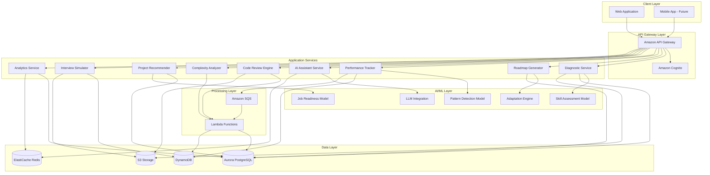

# Design Document: Adaptive Tech Skill Accelerator

## Overview

The Adaptive Tech Skill Accelerator is a cloud-native, AI-powered learning platform that uses live coding diagnostics to assess learners' technical skills and generates personalized, adaptive learning roadmaps. The platform continuously monitors performance, provides intelligent assistance, and predicts job readiness for technology learners across India.

### Key Design Principles

1. **Assessment-First Approach**: Real coding behavior over multiple-choice questions
2. **Continuous Adaptation**: Learning paths evolve based on real-time performance data
3. **AI-Augmented Learning**: Intelligent assistance without removing learning challenges
4. **Scalability**: Cloud-native architecture supporting millions of concurrent learners
5. **Privacy-Preserving**: Secure handling of learner data with compliance to Indian regulations
6. **Multilingual**: Support for diverse Indian language preferences

### Technology Stack

- **Backend**: Python (FastAPI) for API services, Node.js for real-time features
- **Frontend**: React with TypeScript for web application
- **AI/ML**: Python (TensorFlow, scikit-learn) for ML models, OpenAI API for LLM features
- **Database**: Amazon Aurora PostgreSQL (relational), Amazon DynamoDB (NoSQL for sessions)
- **Cache**: Amazon ElastiCache (Redis) for performance optimization
- **Storage**: Amazon S3 for code submissions and static content
- **Compute**: AWS Lambda for serverless functions, ECS for containerized services
- **Message Queue**: Amazon SQS for asynchronous processing
- **CDN**: Amazon CloudFront for global content delivery
- **Authentication**: Amazon Cognito for user management
- **Monitoring**: Amazon CloudWatch, AWS X-Ray for distributed tracing

## Architecture

### High-Level Architecture




### Microservices Architecture

The platform follows a microservices architecture with the following key services:

1. **Diagnostic Service**: Manages live coding assessments and skill analysis
2. **Roadmap Generator Service**: Creates and updates personalized learning paths
3. **Performance Tracker Service**: Monitors learner progress and detects patterns
4. **AI Assistant Service**: Provides debugging help and contextual guidance
5. **Code Review Engine**: Analyzes code quality and provides feedback
6. **Complexity Analyzer Service**: Evaluates algorithmic efficiency
7. **Project Recommender Service**: Suggests relevant projects based on skills
8. **Interview Simulator Service**: Manages interview practice sessions
9. **Analytics Service**: Aggregates data for dashboards and reporting
10. **User Management Service**: Handles authentication and profile management

### Data Flow

1. **Diagnostic Flow**: Learner → Diagnostic Service → Code Execution → Skill Model → Assessment Results → Roadmap Generator
2. **Learning Flow**: Learner → Challenge/Module → Code Submission → Performance Tracker → Adaptation Engine → Updated Roadmap
3. **Assistance Flow**: Learner → AI Assistant → LLM → Contextual Help → Learner
4. **Review Flow**: Code Submission → S3 → Lambda (Code Review) → Feedback → Learner

## Components and Interfaces

### 1. Diagnostic Service

**Responsibilities**:
- Present coding problems for assessment
- Capture real-time coding behavior (keystrokes, debugging actions, execution attempts)
- Execute submitted code securely in sandboxed environments
- Extract features for skill assessment model
- Store diagnostic session data

**Key Interfaces**:

```python
class DiagnosticService:
    def start_diagnostic_session(self, learner_id: str, language: str) -> DiagnosticSession
    def get_diagnostic_problem(self, session_id: str, problem_index: int) -> Problem
    def submit_diagnostic_solution(self, session_id: str, problem_id: str, code: str, metadata: CodeMetadata) -> SubmissionResult
    def analyze_diagnostic_session(self, session_id: str) -> SkillAssessment
    def capture_coding_behavior(self, session_id: str, behavior_event: BehaviorEvent) -> None
```

**Data Models**:

```python
@dataclass
class DiagnosticSession:
    session_id: str
    learner_id: str
    start_time: datetime
    problems: List[Problem]
    status: SessionStatus
    language: str

@dataclass
class Problem:
    problem_id: str
    title: str
    description: str
    difficulty: Difficulty
    skill_domains: List[SkillDomain]
    test_cases: List[TestCase]
    time_limit: int

@dataclass
class CodeMetadata:
    execution_attempts: int
    debug_actions: List[DebugAction]
    time_spent: int
    syntax_errors: List[SyntaxError]
    logical_errors: int

@dataclass
class SkillAssessment:
    learner_id: str
    skill_levels: Dict[SkillDomain, SkillLevel]
    conceptual_gaps: List[ConceptGap]
    strengths: List[str]
    assessment_confidence: float
```

### 2. Skill Assessment Model

**Responsibilities**:
- Analyze coding behavior patterns
- Classify skill levels across domains
- Identify conceptual gaps
- Generate confidence scores for assessments

**ML Model Architecture**:
- **Input Features**: Code complexity metrics, error patterns, time-to-solution, debugging behavior, syntax patterns, test case pass rates
- **Model Type**: Gradient Boosting (XGBoost) for skill classification, Neural Network for pattern recognition
- **Output**: Skill level per domain (Beginner, Intermediate, Advanced, Expert), conceptual gap identification

**Key Interfaces**:

```python
class SkillAssessmentModel:
    def extract_features(self, session_data: DiagnosticSession, submissions: List[CodeSubmission]) -> FeatureVector
    def predict_skill_levels(self, features: FeatureVector) -> Dict[SkillDomain, SkillLevel]
    def identify_conceptual_gaps(self, features: FeatureVector, skill_levels: Dict[SkillDomain, SkillLevel]) -> List[ConceptGap]
    def calculate_confidence(self, features: FeatureVector, predictions: Dict[SkillDomain, SkillLevel]) -> float
```

### 3. Roadmap Generator Service

**Responsibilities**:
- Generate personalized learning roadmaps based on skill assessments
- Include daily challenges, modules, projects, and revision cycles
- Set realistic time bounds
- Adapt roadmaps based on performance data

**Key Interfaces**:

```python
class RoadmapGeneratorService:
    def generate_roadmap(self, skill_assessment: SkillAssessment, learner_goals: LearnerGoals) -> LearningRoadmap
    def adapt_roadmap(self, learner_id: str, performance_data: PerformanceData) -> LearningRoadmap
    def get_daily_tasks(self, learner_id: str, date: date) -> List[Task]
    def mark_task_complete(self, learner_id: str, task_id: str, completion_data: CompletionData) -> None
```

**Data Models**:

```python
@dataclass
class LearningRoadmap:
    roadmap_id: str
    learner_id: str
    start_date: date
    estimated_completion: date
    skill_targets: Dict[SkillDomain, SkillLevel]
    daily_tasks: Dict[date, List[Task]]
    milestones: List[Milestone]
    revision_cycles: List[RevisionCycle]

@dataclass
class Task:
    task_id: str
    task_type: TaskType  # CHALLENGE, MODULE, PROJECT, INTERVIEW_PRACTICE
    title: str
    description: str
    skill_domain: SkillDomain
    difficulty: Difficulty
    estimated_time: int
    learning_objectives: List[str]
    prerequisites: List[str]

@dataclass
class Milestone:
    milestone_id: str
    title: str
    target_date: date
    completion_criteria: List[str]
    reward: str
```

### 4. Performance Tracker Service

**Responsibilities**:
- Monitor learner progress on tasks
- Detect inefficient code patterns
- Calculate productivity analytics
- Model learning speed
- Trigger roadmap adaptations

**Key Interfaces**:

```python
class PerformanceTrackerService:
    def record_task_completion(self, learner_id: str, task_id: str, completion_data: CompletionData) -> None
    def detect_code_patterns(self, learner_id: str, code: str) -> List[CodePattern]
    def get_productivity_analytics(self, learner_id: str, time_range: TimeRange) -> ProductivityAnalytics
    def calculate_learning_speed(self, learner_id: str) -> LearningSpeedModel
    def check_adaptation_trigger(self, learner_id: str) -> Optional[AdaptationTrigger]
```

**Data Models**:

```python
@dataclass
class CompletionData:
    completion_time: int
    correctness_score: float
    code_quality_score: float
    approach_quality: ApproachQuality
    hints_used: int
    attempts: int

@dataclass
class CodePattern:
    pattern_type: PatternType  # INEFFICIENT_LOOP, REDUNDANT_COMPUTATION, MEMORY_LEAK, etc.
    severity: Severity
    location: CodeLocation
    description: str
    optimization_suggestion: str

@dataclass
class ProductivityAnalytics:
    tasks_completed: int
    average_completion_time: float
    streak_days: int
    skill_progression: Dict[SkillDomain, List[SkillLevel]]
    time_invested: int
    efficiency_trend: TrendDirection
```


### 5. Pattern Detection Model

**Responsibilities**:
- Identify inefficient coding patterns using static analysis
- Detect recurring mistakes and anti-patterns
- Learn from historical code submissions

**ML Model Architecture**:
- **Input**: Abstract Syntax Tree (AST) representation, code metrics, execution traces
- **Model Type**: Recurrent Neural Network (LSTM) for sequence pattern detection, Rule-based system for known anti-patterns
- **Output**: List of detected patterns with severity and suggestions

**Key Interfaces**:

```python
class PatternDetectionModel:
    def analyze_code(self, code: str, language: str) -> List[CodePattern]
    def learn_from_feedback(self, code: str, pattern: CodePattern, learner_feedback: bool) -> None
    def get_optimization_suggestion(self, pattern: CodePattern, context: CodeContext) -> OptimizationSuggestion
```

### 6. AI Assistant Service

**Responsibilities**:
- Provide contextual debugging help
- Explain concepts without revealing solutions
- Maintain conversation context
- Identify underlying conceptual gaps from repeated errors

**Key Interfaces**:

```python
class AIAssistantService:
    def request_debugging_help(self, learner_id: str, code: str, error: str, context: ProblemContext) -> AssistantResponse
    def explain_concept(self, learner_id: str, concept: str, difficulty_level: Difficulty) -> ConceptExplanation
    def get_conversation_history(self, learner_id: str, session_id: str) -> List[Message]
    def identify_conceptual_gap(self, learner_id: str, error_history: List[Error]) -> ConceptGap
```

**LLM Integration**:
- Use OpenAI GPT-4 for natural language understanding and generation
- Implement prompt engineering to avoid revealing complete solutions
- Maintain conversation context using Redis cache
- Apply rate limiting per learner to manage costs

**Data Models**:

```python
@dataclass
class AssistantResponse:
    response_id: str
    message: str
    suggestions: List[str]
    conceptual_hints: List[str]
    related_resources: List[Resource]
    confidence: float

@dataclass
class ConceptExplanation:
    concept: str
    explanation: str
    examples: List[CodeExample]
    practice_problems: List[Problem]
    difficulty_level: Difficulty
```

### 7. Code Review Engine

**Responsibilities**:
- Analyze code quality, readability, and maintainability
- Identify code smells and anti-patterns
- Provide actionable feedback
- Assign quality scores

**Key Interfaces**:

```python
class CodeReviewEngine:
    def review_code(self, code: str, language: str, context: ReviewContext) -> CodeReview
    def calculate_quality_score(self, code: str, language: str) -> QualityScore
    def identify_code_smells(self, code: str, language: str) -> List[CodeSmell]
    def suggest_improvements(self, code: str, code_smells: List[CodeSmell]) -> List[Improvement]
```

**Analysis Techniques**:
- Static analysis using language-specific linters (pylint, ESLint, etc.)
- Complexity metrics (cyclomatic complexity, cognitive complexity)
- Naming convention checks
- Documentation coverage
- Test coverage analysis (when applicable)

**Data Models**:

```python
@dataclass
class CodeReview:
    review_id: str
    code_id: str
    quality_score: QualityScore
    code_smells: List[CodeSmell]
    improvements: List[Improvement]
    best_practices_adherence: float
    timestamp: datetime

@dataclass
class QualityScore:
    overall_score: float
    readability: float
    maintainability: float
    efficiency: float
    best_practices: float
    breakdown: Dict[str, float]

@dataclass
class CodeSmell:
    smell_type: SmellType
    severity: Severity
    location: CodeLocation
    description: str
    impact: str

@dataclass
class Improvement:
    improvement_type: ImprovementType
    priority: Priority
    description: str
    code_example: Optional[str]
    expected_benefit: str
```

### 8. Complexity Analyzer Service

**Responsibilities**:
- Analyze time and space complexity of code
- Identify Big-O notation
- Compare against optimal solutions
- Suggest more efficient approaches

**Key Interfaces**:

```python
class ComplexityAnalyzerService:
    def analyze_complexity(self, code: str, language: str) -> ComplexityAnalysis
    def identify_big_o(self, code: str, language: str) -> BigONotation
    def compare_with_optimal(self, code: str, problem_id: str) -> ComplexityComparison
    def suggest_optimization(self, analysis: ComplexityAnalysis, problem_id: str) -> OptimizationSuggestion
```

**Analysis Approach**:
- Parse code into AST
- Identify loops, recursive calls, and data structure operations
- Calculate complexity based on control flow analysis
- Use heuristics and pattern matching for common algorithms
- Compare with known optimal solutions for specific problems

**Data Models**:

```python
@dataclass
class ComplexityAnalysis:
    time_complexity: BigONotation
    space_complexity: BigONotation
    bottlenecks: List[Bottleneck]
    explanation: str
    confidence: float

@dataclass
class BigONotation:
    notation: str  # e.g., "O(n log n)"
    best_case: str
    average_case: str
    worst_case: str

@dataclass
class ComplexityComparison:
    learner_complexity: BigONotation
    optimal_complexity: BigONotation
    is_optimal: bool
    efficiency_gap: str
    improvement_potential: str

@dataclass
class Bottleneck:
    location: CodeLocation
    operation: str
    complexity_contribution: str
    suggestion: str
```

### 9. Project Recommender Service

**Responsibilities**:
- Recommend projects based on skill level and gaps
- Provide project metadata and requirements
- Assess completed projects
- Track project completion

**Key Interfaces**:

```python
class ProjectRecommenderService:
    def recommend_projects(self, learner_id: str, skill_assessment: SkillAssessment) -> List[Project]
    def get_project_details(self, project_id: str) -> ProjectDetails
    def submit_project(self, learner_id: str, project_id: str, repository_url: str) -> ProjectSubmission
    def assess_project(self, submission_id: str) -> ProjectAssessment
```

**Recommendation Algorithm**:
- Match project requirements with learner's current skills
- Prioritize projects that address identified skill gaps
- Consider learner's career goals and interests
- Balance difficulty to maintain engagement
- Use collaborative filtering based on similar learners' success

**Data Models**:

```python
@dataclass
class Project:
    project_id: str
    title: str
    description: str
    difficulty: Difficulty
    required_skills: List[SkillDomain]
    technologies: List[str]
    estimated_hours: int
    learning_outcomes: List[str]
    prerequisites: List[str]

@dataclass
class ProjectAssessment:
    assessment_id: str
    submission_id: str
    completeness_score: float
    code_quality_score: float
    functionality_score: float
    feedback: str
    skills_demonstrated: List[SkillDomain]
    areas_for_improvement: List[str]
```

### 10. Interview Simulator Service

**Responsibilities**:
- Present time-bound coding problems
- Simulate interview pressure
- Record sessions for review
- Provide performance analysis

**Key Interfaces**:

```python
class InterviewSimulatorService:
    def start_interview_session(self, learner_id: str, interview_type: InterviewType) -> InterviewSession
    def get_interview_problem(self, session_id: str) -> InterviewProblem
    def submit_interview_solution(self, session_id: str, code: str, explanation: str) -> SubmissionResult
    def end_interview_session(self, session_id: str) -> InterviewAnalysis
    def get_session_recording(self, session_id: str) -> SessionRecording
```

**Interview Types**:
- Algorithmic coding interviews
- System design interviews
- Debugging interviews
- Behavioral + technical hybrid

**Data Models**:

```python
@dataclass
class InterviewSession:
    session_id: str
    learner_id: str
    interview_type: InterviewType
    start_time: datetime
    time_limit: int
    problems: List[InterviewProblem]
    status: SessionStatus

@dataclass
class InterviewAnalysis:
    session_id: str
    overall_score: float
    problem_solving_score: float
    code_quality_score: float
    communication_score: float
    time_management_score: float
    detailed_feedback: str
    strengths: List[str]
    areas_for_improvement: List[str]
    comparison_to_peers: PercentileRank
```

### 11. Job Readiness Model

**Responsibilities**:
- Calculate job readiness scores
- Provide domain-specific readiness breakdowns
- Suggest improvements
- Compare against hiring standards

**ML Model Architecture**:
- **Input Features**: Skill assessments, project completions, interview performance, code quality metrics, learning consistency
- **Model Type**: Ensemble model combining regression and classification
- **Output**: Overall readiness score (0-100), domain-specific scores, role-specific readiness

**Key Interfaces**:

```python
class JobReadinessModel:
    def calculate_readiness_score(self, learner_id: str) -> ReadinessScore
    def get_domain_breakdown(self, learner_id: str) -> Dict[SkillDomain, float]
    def get_role_readiness(self, learner_id: str, target_role: JobRole) -> RoleReadiness
    def suggest_improvements(self, learner_id: str, target_role: JobRole) -> List[ImprovementSuggestion]
    def compare_with_standards(self, learner_id: str, companies: List[str]) -> CompanyComparison
```

**Data Models**:

```python
@dataclass
class ReadinessScore:
    overall_score: float
    domain_scores: Dict[SkillDomain, float]
    confidence: float
    last_updated: datetime
    trend: TrendDirection

@dataclass
class RoleReadiness:
    role: JobRole
    readiness_score: float
    required_skills_met: List[str]
    skill_gaps: List[str]
    estimated_time_to_ready: int
    recommendation: str
```


### 12. Burnout Detection and Workload Balancer

**Responsibilities**:
- Monitor engagement patterns
- Calculate burnout risk
- Adjust workload dynamically
- Suggest breaks and pacing changes

**Key Interfaces**:

```python
class BurnoutDetectionService:
    def monitor_engagement(self, learner_id: str) -> EngagementMetrics
    def calculate_burnout_risk(self, learner_id: str) -> BurnoutRisk
    def adjust_workload(self, learner_id: str, burnout_risk: BurnoutRisk) -> WorkloadAdjustment
    def suggest_break(self, learner_id: str) -> BreakSuggestion
```

**Detection Algorithm**:
- Track session duration, frequency, and time-of-day patterns
- Monitor completion rates and quality trends
- Detect sudden drops in engagement or performance
- Calculate burnout risk score using weighted factors
- Threshold-based intervention triggers

**Data Models**:

```python
@dataclass
class EngagementMetrics:
    average_session_duration: float
    sessions_per_week: float
    completion_rate: float
    quality_trend: TrendDirection
    last_active: datetime
    streak_days: int

@dataclass
class BurnoutRisk:
    risk_score: float  # 0-100
    risk_level: RiskLevel  # LOW, MEDIUM, HIGH, CRITICAL
    contributing_factors: List[str]
    recommendation: str

@dataclass
class WorkloadAdjustment:
    adjustment_type: AdjustmentType  # REDUCE, MAINTAIN, INCREASE
    new_daily_tasks: int
    new_difficulty_distribution: Dict[Difficulty, float]
    break_days: List[date]
    explanation: str
```

### 13. Analytics and Benchmarking Service

**Responsibilities**:
- Aggregate learner performance data
- Provide peer benchmarking
- Generate progress visualizations
- Export reports

**Key Interfaces**:

```python
class AnalyticsService:
    def get_learner_dashboard(self, learner_id: str) -> Dashboard
    def get_peer_benchmarks(self, learner_id: str) -> PeerBenchmarks
    def get_progress_over_time(self, learner_id: str, time_range: TimeRange) -> ProgressTimeline
    def export_progress_report(self, learner_id: str, format: ReportFormat) -> Report
    def get_skill_progression(self, learner_id: str, skill_domain: SkillDomain) -> SkillProgression
```

**Data Models**:

```python
@dataclass
class Dashboard:
    learner_id: str
    overall_progress: float
    skill_levels: Dict[SkillDomain, SkillLevel]
    streak_days: int
    tasks_completed: int
    time_invested: int
    achievements: List[Achievement]
    next_milestone: Milestone
    recent_activity: List[Activity]

@dataclass
class PeerBenchmarks:
    learner_percentile: Dict[SkillDomain, float]
    average_progress_speed: float
    learner_progress_speed: float
    average_time_to_completion: Dict[TaskType, float]
    cohort_size: int
    anonymized: bool

@dataclass
class ProgressTimeline:
    time_range: TimeRange
    skill_progression: Dict[SkillDomain, List[Tuple[date, SkillLevel]]]
    tasks_completed_over_time: List[Tuple[date, int]]
    quality_scores_over_time: List[Tuple[date, float]]
    milestones_reached: List[Tuple[date, Milestone]]
```

### 14. Resume Skill Gap Analyzer

**Responsibilities**:
- Extract skills from resumes
- Identify job requirements
- Compare and generate gap analysis
- Suggest learning paths

**Key Interfaces**:

```python
class ResumeSkillGapAnalyzer:
    def extract_skills_from_resume(self, resume_file: File) -> ExtractedSkills
    def get_job_requirements(self, job_role: JobRole, companies: List[str]) -> JobRequirements
    def analyze_skill_gaps(self, learner_skills: ExtractedSkills, job_requirements: JobRequirements) -> SkillGapAnalysis
    def suggest_learning_path(self, skill_gaps: SkillGapAnalysis) -> LearningPath
```

**Resume Parsing**:
- Use NLP models to extract technical skills, experience, and education
- Identify programming languages, frameworks, tools, and methodologies
- Parse project descriptions for implicit skills
- Normalize skill names to standard taxonomy

**Data Models**:

```python
@dataclass
class ExtractedSkills:
    technical_skills: List[str]
    programming_languages: List[str]
    frameworks: List[str]
    tools: List[str]
    experience_years: Dict[str, float]
    projects: List[ProjectDescription]
    certifications: List[str]

@dataclass
class JobRequirements:
    role: JobRole
    required_skills: List[str]
    preferred_skills: List[str]
    experience_level: ExperienceLevel
    common_interview_topics: List[str]

@dataclass
class SkillGapAnalysis:
    missing_required_skills: List[str]
    missing_preferred_skills: List[str]
    skills_to_strengthen: List[str]
    priority_order: List[str]
    estimated_learning_time: Dict[str, int]
```

## Data Models

### Core Entities

```python
# Enumerations
class SkillDomain(Enum):
    DSA = "Data Structures and Algorithms"
    OOP = "Object-Oriented Programming"
    DBMS = "Database Management Systems"
    WEB_DEV = "Web Development"
    SYSTEM_DESIGN = "System Design"

class SkillLevel(Enum):
    BEGINNER = 1
    INTERMEDIATE = 2
    ADVANCED = 3
    EXPERT = 4

class Difficulty(Enum):
    EASY = 1
    MEDIUM = 2
    HARD = 3
    EXPERT = 4

class TaskType(Enum):
    CHALLENGE = "coding_challenge"
    MODULE = "concept_module"
    PROJECT = "project"
    INTERVIEW_PRACTICE = "interview_practice"
    REVISION = "revision"

class SessionStatus(Enum):
    IN_PROGRESS = "in_progress"
    COMPLETED = "completed"
    ABANDONED = "abandoned"

# Learner Profile
@dataclass
class LearnerProfile:
    learner_id: str
    email: str
    name: str
    preferred_language: str
    career_goals: List[str]
    target_roles: List[JobRole]
    current_skill_levels: Dict[SkillDomain, SkillLevel]
    learning_preferences: LearningPreferences
    created_at: datetime
    last_active: datetime

@dataclass
class LearningPreferences:
    preferred_difficulty: Difficulty
    daily_time_commitment: int
    learning_pace: LearningPace
    notification_preferences: NotificationPreferences
```

### Database Schema Design

**PostgreSQL (Aurora) - Relational Data**:

```sql
-- Learners table
CREATE TABLE learners (
    learner_id UUID PRIMARY KEY,
    email VARCHAR(255) UNIQUE NOT NULL,
    name VARCHAR(255) NOT NULL,
    preferred_language VARCHAR(10) NOT NULL,
    created_at TIMESTAMP NOT NULL,
    last_active TIMESTAMP NOT NULL,
    INDEX idx_email (email),
    INDEX idx_last_active (last_active)
);

-- Skill assessments table
CREATE TABLE skill_assessments (
    assessment_id UUID PRIMARY KEY,
    learner_id UUID NOT NULL REFERENCES learners(learner_id),
    skill_domain VARCHAR(50) NOT NULL,
    skill_level INT NOT NULL,
    confidence FLOAT NOT NULL,
    assessed_at TIMESTAMP NOT NULL,
    INDEX idx_learner_domain (learner_id, skill_domain),
    INDEX idx_assessed_at (assessed_at)
);

-- Learning roadmaps table
CREATE TABLE learning_roadmaps (
    roadmap_id UUID PRIMARY KEY,
    learner_id UUID NOT NULL REFERENCES learners(learner_id),
    start_date DATE NOT NULL,
    estimated_completion DATE NOT NULL,
    status VARCHAR(20) NOT NULL,
    created_at TIMESTAMP NOT NULL,
    updated_at TIMESTAMP NOT NULL,
    INDEX idx_learner (learner_id),
    INDEX idx_status (status)
);

-- Tasks table
CREATE TABLE tasks (
    task_id UUID PRIMARY KEY,
    roadmap_id UUID NOT NULL REFERENCES learning_roadmaps(roadmap_id),
    task_type VARCHAR(30) NOT NULL,
    title VARCHAR(255) NOT NULL,
    skill_domain VARCHAR(50) NOT NULL,
    difficulty INT NOT NULL,
    estimated_time INT NOT NULL,
    scheduled_date DATE NOT NULL,
    completed_at TIMESTAMP,
    INDEX idx_roadmap (roadmap_id),
    INDEX idx_scheduled_date (scheduled_date),
    INDEX idx_completed (completed_at)
);

-- Code submissions table
CREATE TABLE code_submissions (
    submission_id UUID PRIMARY KEY,
    learner_id UUID NOT NULL REFERENCES learners(learner_id),
    task_id UUID REFERENCES tasks(task_id),
    code_s3_key VARCHAR(500) NOT NULL,
    language VARCHAR(20) NOT NULL,
    submitted_at TIMESTAMP NOT NULL,
    correctness_score FLOAT,
    quality_score FLOAT,
    INDEX idx_learner (learner_id),
    INDEX idx_task (task_id),
    INDEX idx_submitted_at (submitted_at)
);

-- Projects table
CREATE TABLE projects (
    project_id UUID PRIMARY KEY,
    title VARCHAR(255) NOT NULL,
    description TEXT NOT NULL,
    difficulty INT NOT NULL,
    required_skills JSONB NOT NULL,
    technologies JSONB NOT NULL,
    estimated_hours INT NOT NULL,
    INDEX idx_difficulty (difficulty)
);

-- Interview sessions table
CREATE TABLE interview_sessions (
    session_id UUID PRIMARY KEY,
    learner_id UUID NOT NULL REFERENCES learners(learner_id),
    interview_type VARCHAR(30) NOT NULL,
    start_time TIMESTAMP NOT NULL,
    end_time TIMESTAMP,
    overall_score FLOAT,
    recording_s3_key VARCHAR(500),
    INDEX idx_learner (learner_id),
    INDEX idx_start_time (start_time)
);
```

**DynamoDB - NoSQL for High-Velocity Data**:

```python
# Performance tracking events (high write volume)
{
    "PK": "LEARNER#{learner_id}",
    "SK": "EVENT#{timestamp}#{event_id}",
    "event_type": "task_completion | code_submission | session_start",
    "data": {...},
    "timestamp": "ISO8601",
    "ttl": 7776000  # 90 days
}

# Real-time session data
{
    "PK": "SESSION#{session_id}",
    "SK": "METADATA",
    "learner_id": "...",
    "session_type": "diagnostic | interview | practice",
    "start_time": "...",
    "behavior_events": [...],
    "ttl": 2592000  # 30 days
}

# Code patterns cache
{
    "PK": "LEARNER#{learner_id}",
    "SK": "PATTERNS",
    "detected_patterns": [...],
    "last_updated": "...",
    "ttl": 7776000  # 90 days
}
```


## Correctness Properties

*A property is a characteristic or behavior that should hold true across all valid executions of a system—essentially, a formal statement about what the system should do. Properties serve as the bridge between human-readable specifications and machine-verifiable correctness guarantees.*

### Property Reflection

After analyzing all acceptance criteria, I've identified opportunities to consolidate related properties:

- Requirements 2.2-2.6 (roadmap content types) can be combined into a single comprehensive property about roadmap completeness
- Requirements 5.2 and 5.5 (code review metrics) can be combined into one property about review completeness
- Requirements 6.4 and 6.5 (complexity comparison and explanation) can be combined
- Requirements 7.3 and 7.4 (project metadata) can be combined
- Requirements 9.2, 9.3, and 9.4 (benchmark components) can be combined
- Requirements 17.1 and 17.2 (dashboard metrics) can be combined

### Diagnostic and Assessment Properties

**Property 1: Multi-domain diagnostic coverage**
*For any* diagnostic session, the presented problems should cover all five skill domains (DSA, OOP, DBMS, Web Development, System Design).
**Validates: Requirements 1.1**

**Property 2: Behavior capture completeness**
*For any* code submission during a diagnostic session, the platform should capture all required behavior metrics (problem-solving approach, debugging actions, syntax patterns, logical flow, code structure).
**Validates: Requirements 1.2**

**Property 3: Session analysis completeness**
*For any* completed diagnostic session, the analysis should include time-complexity awareness metrics and error repetition pattern analysis.
**Validates: Requirements 1.3**

**Property 4: Skill classification completeness**
*For any* diagnostic analysis, the output should include skill level classifications for all five domains (DSA, OOP, DBMS, Web Development, System Design).
**Validates: Requirements 1.4**

**Property 5: Conceptual gap persistence**
*For any* diagnostic session where conceptual gaps are identified, those gaps should be retrievable for subsequent roadmap generation.
**Validates: Requirements 1.5**

### Roadmap Generation Properties

**Property 6: Roadmap generation trigger**
*For any* completed diagnostic analysis, a time-bound learning roadmap should be generated based on the identified skill gaps.
**Validates: Requirements 2.1**

**Property 7: Roadmap content completeness**
*For any* generated learning roadmap, it should include all required task types: daily coding challenges, concept reinforcement modules, project-based tasks, revision cycles, and interview-oriented practice.
**Validates: Requirements 2.2, 2.3, 2.4, 2.5, 2.6**

**Property 8: Time bound variation by skill level**
*For any* two learners with different skill levels, their generated roadmaps should have different time bounds that reflect their respective skill levels.
**Validates: Requirements 2.7**

### Performance Tracking Properties

**Property 9: Challenge completion recording**
*For any* completed coding challenge, the performance tracker should record completion time, correctness score, and approach quality metrics.
**Validates: Requirements 3.1**

**Property 10: Inefficient pattern detection**
*For any* code submission containing known inefficient patterns (nested loops with redundant operations, unnecessary memory allocations, etc.), the performance tracker should detect and flag those patterns.
**Validates: Requirements 3.2**

**Property 11: Pattern-suggestion coupling**
*For any* detected inefficient code pattern, the platform should provide at least one optimization suggestion.
**Validates: Requirements 3.3**

**Property 12: Analytics persistence and retrieval**
*For any* learner, productivity analytics should be retrievable and should update after each task completion.
**Validates: Requirements 3.4**

**Property 13: Learning speed model existence**
*For any* learner with historical performance data, a learning speed model should be calculable and should change as new performance data is added.
**Validates: Requirements 3.5**

**Property 14: Performance-based roadmap adaptation**
*For any* learner whose performance crosses significant thresholds (e.g., consistent high scores or consistent failures), the learning roadmap should be adapted accordingly.
**Validates: Requirements 3.6**

### AI Assistant Properties

**Property 15: Debugging help response**
*For any* debugging help request with valid code and error context, the AI assistant should return a response containing suggestions.
**Validates: Requirements 4.1, 4.2**

**Property 16: Reasoning inclusion**
*For any* AI assistant debugging response, the response should include explanatory reasoning for the suggestions provided.
**Validates: Requirements 4.3**

**Property 17: Repeated error pattern recognition**
*For any* learner who submits similar errors multiple times (same error type in different contexts), the AI assistant should identify an underlying conceptual gap.
**Validates: Requirements 4.4**

**Property 18: Conversation context persistence**
*For any* sequence of debugging requests within the same session, later responses should reference or build upon earlier interactions in the conversation.
**Validates: Requirements 4.5**

### Code Review Properties

**Property 19: Review trigger on submission**
*For any* code submission, an automated code review should be performed and results should be available.
**Validates: Requirements 5.1**

**Property 20: Review metric completeness**
*For any* code review, the results should include evaluations for readability, maintainability, best practices adherence, and a quality score with detailed breakdown.
**Validates: Requirements 5.2, 5.5**

**Property 21: Code smell detection**
*For any* code submission containing known code smells (long methods, duplicate code, large classes, etc.), the review should identify those smells.
**Validates: Requirements 5.3**

**Property 22: Feedback provision**
*For any* completed code review, specific feedback should be provided to the learner.
**Validates: Requirements 5.4**

### Complexity Analysis Properties

**Property 23: Complexity analysis trigger**
*For any* code submission, time complexity analysis should be performed.
**Validates: Requirements 6.1**

**Property 24: Big-O identification accuracy**
*For any* code submission with known algorithmic complexity (e.g., simple loop = O(n), nested loops = O(n²)), the platform should correctly identify the Big-O notation.
**Validates: Requirements 6.2**

**Property 25: Suboptimal complexity suggestions**
*For any* code submission where the complexity is suboptimal compared to the known optimal solution for that problem, the platform should provide efficiency improvement suggestions.
**Validates: Requirements 6.3**

**Property 26: Complexity comparison and explanation**
*For any* complexity analysis, the results should include both a comparison with the optimal solution and an explanation of why specific operations contribute to the overall complexity.
**Validates: Requirements 6.4, 6.5**

### Project Recommendation Properties

**Property 27: Milestone-triggered recommendations**
*For any* learner who reaches a milestone in their roadmap, project recommendations should be generated.
**Validates: Requirements 7.1**

**Property 28: Recommendation-gap alignment**
*For any* project recommendation, the project's required skills should overlap with the learner's identified skill gaps or learning goals.
**Validates: Requirements 7.2**

**Property 29: Project metadata completeness**
*For any* project recommendation, it should include difficulty rating, estimated completion time, required technologies, and learning outcomes.
**Validates: Requirements 7.3, 7.4**

**Property 30: Project assessment on completion**
*For any* submitted project, an assessment should be performed and feedback should be provided.
**Validates: Requirements 7.5**

### Burnout Detection Properties

**Property 31: Engagement monitoring**
*For any* learner, engagement metrics (patterns, completion rates, session durations) should be tracked and retrievable.
**Validates: Requirements 8.1**

**Property 32: Burnout risk calculation trigger**
*For any* learner whose engagement drops significantly or whose session patterns become irregular, a burnout risk score should be calculated.
**Validates: Requirements 8.2**

**Property 33: High burnout intervention**
*For any* learner whose burnout risk score exceeds the threshold, the platform should reduce daily workload and suggest breaks.
**Validates: Requirements 8.3**

**Property 34: Performance-based pacing adjustment**
*For any* learner with sustained performance trends (consistently high or low), the roadmap pacing should be adjusted.
**Validates: Requirements 8.4**

**Property 35: Excellence-based difficulty increase**
*For any* learner who consistently exceeds targets, the platform should offer to increase challenge difficulty.
**Validates: Requirements 8.5**

### Benchmarking Properties

**Property 36: Benchmark anonymization**
*For any* peer benchmark data, no personally identifiable information should be present in the returned data.
**Validates: Requirements 9.1, 9.5**

**Property 37: Benchmark completeness**
*For any* benchmarking request, the results should include percentile rankings by skill domain, progress speed comparison, and average time-to-completion for challenges and projects.
**Validates: Requirements 9.2, 9.3, 9.4**

### Resume Analysis Properties

**Property 38: Resume skill extraction**
*For any* uploaded resume file, the platform should extract and return technical skills and experience data.
**Validates: Requirements 10.1**

**Property 39: Job requirement identification**
*For any* specified target job role, the platform should return a list of required skills for that role.
**Validates: Requirements 10.2**

**Property 40: Skill gap comparison**
*For any* skill gap analysis, the results should include a comparison between the learner's current skills and job requirements.
**Validates: Requirements 10.3**

**Property 41: Gap prioritization**
*For any* skill gap analysis, the results should include a prioritized list of skill gaps.
**Validates: Requirements 10.4**

**Property 42: Gap-based learning path suggestions**
*For any* skill gap analysis, the results should include learning path suggestions to address the identified gaps.
**Validates: Requirements 10.5**

### Interview Simulation Properties

**Property 43: Interview problem presentation**
*For any* interview simulation session, the platform should present time-bound coding problems.
**Validates: Requirements 11.1**

**Property 44: Pressure simulation features**
*For any* interview simulation session, countdown timers and hint limits should be active.
**Validates: Requirements 11.2**

**Property 45: Interview analysis completeness**
*For any* completed interview simulation, the performance analysis should include problem-solving approach evaluation and communication clarity assessment.
**Validates: Requirements 11.3**

**Property 46: Interview type availability**
*For any* learner, both algorithmic and system design interview simulation types should be available to start.
**Validates: Requirements 11.4**

**Property 47: Session recording availability**
*For any* completed interview simulation session, a recording should be retrievable for learner review.
**Validates: Requirements 11.5**

### Job Readiness Properties

**Property 48: Readiness score calculation**
*For any* learner with skill assessments, project completions, and interview simulations, a job readiness score should be calculable.
**Validates: Requirements 12.1**

**Property 49: Readiness breakdown completeness**
*For any* job readiness score, breakdowns by skill domain and job role category should be included.
**Validates: Requirements 12.2**

**Property 50: Significant change notification**
*For any* learner whose readiness score changes by more than a significant threshold, a notification should be triggered.
**Validates: Requirements 12.3**

**Property 51: Readiness improvement suggestions**
*For any* job readiness score, specific improvement suggestions should be included.
**Validates: Requirements 12.4**

**Property 52: Company standard comparison**
*For any* job readiness score with specified target companies, the results should include comparisons against hiring standards for those companies.
**Validates: Requirements 12.5**

### Multilingual Support Properties

**Property 53: Language switching without data loss**
*For any* learner who switches their preferred language, all user data and progress should be preserved after the switch.
**Validates: Requirements 13.3**

**Property 54: Code-text translation separation**
*For any* content containing code examples, the code should remain in English while explanatory text should be translated to the selected language.
**Validates: Requirements 13.5**

### Security Properties

**Property 55: Data encryption**
*For any* learner data stored or transmitted, encryption should be applied.
**Validates: Requirements 15.1**

**Property 56: Authentication requirement**
*For any* API endpoint request without valid authentication, the request should be rejected.
**Validates: Requirements 15.2**

**Property 57: Data deletion compliance**
*For any* learner who requests data deletion, all personal information should be removed from the system.
**Validates: Requirements 15.4**

**Property 58: Rate limiting enforcement**
*For any* client making excessive requests beyond the rate limit threshold, subsequent requests should be rate limited or rejected.
**Validates: Requirements 15.6**

**Property 59: Audit log creation**
*For any* data access or modification operation, an audit log entry should be created.
**Validates: Requirements 15.7**

### Account Management Properties

**Property 60: Registration with verification**
*For any* new user registration, an account should be created and an email verification should be sent.
**Validates: Requirements 16.1**

**Property 61: Profile update persistence**
*For any* profile information update (skill interests, career goals), the changes should persist and be retrievable.
**Validates: Requirements 16.3**

**Property 62: Cross-session progress persistence**
*For any* learner who logs out and logs back in, their learning history and progress should be maintained.
**Validates: Requirements 16.4**

**Property 63: Roadmap position restoration**
*For any* learner who logs in, their current position in the learning roadmap should be restored to the state before logout.
**Validates: Requirements 16.5**

### Analytics and Visualization Properties

**Property 64: Dashboard metric completeness**
*For any* learner dashboard, it should include overall progress across skill domains, learning streaks, completed challenges, and time invested.
**Validates: Requirements 17.1, 17.2**

**Property 65: Skill progression data availability**
*For any* learner with historical activity, skill level progression data over time should be available.
**Validates: Requirements 17.3**

**Property 66: Achievement display**
*For any* learner dashboard, achievements and milestones reached should be highlighted.
**Validates: Requirements 17.4**

**Property 67: Progress report export**
*For any* learner, a progress report should be exportable in a shareable format.
**Validates: Requirements 17.5**

### Content Repository Properties

**Property 68: Challenge repository coverage**
*For any* combination of difficulty level and skill domain, at least one coding challenge should exist in the repository.
**Validates: Requirements 18.1**

**Property 69: Module content completeness**
*For any* concept reinforcement module, it should include explanations, examples, and practice problems.
**Validates: Requirements 18.2**

**Property 70: Content metadata completeness**
*For any* content item (challenge or module), it should be tagged with skill domain, difficulty, and learning objectives.
**Validates: Requirements 18.3**

**Property 71: Skill-based content filtering**
*For any* learner, only content appropriate for their skill level should be available to them.
**Validates: Requirements 18.4**

**Property 72: Multi-language challenge support**
*For any* coding challenge, it should be solvable in multiple programming languages (at minimum: Python, JavaScript, Java).
**Validates: Requirements 18.5**


## Error Handling

### Error Categories

1. **User Input Errors**: Invalid code syntax, malformed resume uploads, invalid language selection
2. **System Errors**: Database connection failures, ML model inference errors, external API failures
3. **Resource Errors**: Rate limit exceeded, storage quota exceeded, timeout errors
4. **Security Errors**: Authentication failures, authorization violations, suspicious activity detection
5. **Data Errors**: Corrupted data, missing required fields, data validation failures

### Error Handling Strategy

**Graceful Degradation**:
- If ML models fail, fall back to rule-based systems
- If LLM API is unavailable, provide cached or template-based responses
- If real-time features fail, queue operations for later processing

**User-Friendly Error Messages**:
- Translate technical errors into actionable user guidance
- Provide specific steps for resolution
- Maintain error messages in all supported languages

**Error Recovery**:
- Implement automatic retry with exponential backoff for transient failures
- Maintain operation idempotency to safely retry operations
- Use circuit breakers to prevent cascading failures

**Error Logging and Monitoring**:
- Log all errors with context (user ID, operation, timestamp, stack trace)
- Set up CloudWatch alarms for critical error rates
- Implement distributed tracing with AWS X-Ray for debugging

### Specific Error Scenarios

**Code Execution Errors**:
```python
class CodeExecutionError(Exception):
    """Raised when code execution fails in sandbox"""
    def __init__(self, error_type: str, message: str, line_number: Optional[int]):
        self.error_type = error_type  # SYNTAX, RUNTIME, TIMEOUT, MEMORY
        self.message = message
        self.line_number = line_number
```

**Handling**: Capture error details, provide debugging hints, don't expose system internals

**ML Model Errors**:
```python
class ModelInferenceError(Exception):
    """Raised when ML model inference fails"""
    def __init__(self, model_name: str, reason: str):
        self.model_name = model_name
        self.reason = reason
```

**Handling**: Log error, fall back to rule-based system, alert engineering team

**Rate Limit Errors**:
```python
class RateLimitExceeded(Exception):
    """Raised when user exceeds rate limits"""
    def __init__(self, resource: str, retry_after: int):
        self.resource = resource
        self.retry_after = retry_after
```

**Handling**: Return 429 status code with Retry-After header, inform user of limits

**Authentication Errors**:
```python
class AuthenticationError(Exception):
    """Raised when authentication fails"""
    def __init__(self, reason: str):
        self.reason = reason  # INVALID_TOKEN, EXPIRED_TOKEN, MISSING_TOKEN
```

**Handling**: Return 401 status code, clear client-side auth state, redirect to login

**Data Validation Errors**:
```python
class ValidationError(Exception):
    """Raised when data validation fails"""
    def __init__(self, field: str, constraint: str, value: Any):
        self.field = field
        self.constraint = constraint
        self.value = value
```

**Handling**: Return 400 status code with specific field errors, guide user to correct input

### Timeout Handling

- **Code Execution**: 30-second timeout for diagnostic problems, 60 seconds for projects
- **ML Model Inference**: 10-second timeout with fallback to cached results
- **LLM API Calls**: 30-second timeout with retry logic
- **Database Queries**: 5-second timeout with query optimization alerts

### Data Consistency

- Use database transactions for multi-step operations
- Implement eventual consistency for analytics data
- Use optimistic locking for concurrent updates
- Maintain data integrity constraints at database level

## Testing Strategy

### Dual Testing Approach

The platform requires both unit testing and property-based testing for comprehensive coverage:

- **Unit tests**: Verify specific examples, edge cases, and error conditions
- **Property tests**: Verify universal properties across all inputs
- Both approaches are complementary and necessary

### Unit Testing

**Focus Areas**:
- Specific examples demonstrating correct behavior
- Integration points between microservices
- Edge cases (empty inputs, boundary values, special characters)
- Error conditions and exception handling
- Authentication and authorization flows

**Testing Framework**: pytest (Python), Jest (TypeScript/JavaScript)

**Example Unit Tests**:
```python
def test_diagnostic_session_creation():
    """Test that diagnostic sessions are created with correct initial state"""
    service = DiagnosticService()
    session = service.start_diagnostic_session(learner_id="test-123", language="en")
    
    assert session.learner_id == "test-123"
    assert session.status == SessionStatus.IN_PROGRESS
    assert len(session.problems) > 0
    assert all(p.skill_domains for p in session.problems)

def test_empty_code_submission_rejected():
    """Test that empty code submissions are rejected"""
    service = DiagnosticService()
    with pytest.raises(ValidationError) as exc:
        service.submit_diagnostic_solution(
            session_id="session-123",
            problem_id="prob-1",
            code="",
            metadata=CodeMetadata(...)
        )
    assert "code cannot be empty" in str(exc.value)

def test_rate_limit_enforcement():
    """Test that rate limits are enforced"""
    service = AIAssistantService()
    learner_id = "test-learner"
    
    # Make requests up to limit
    for i in range(10):
        service.request_debugging_help(learner_id, code="...", error="...", context=...)
    
    # Next request should be rate limited
    with pytest.raises(RateLimitExceeded):
        service.request_debugging_help(learner_id, code="...", error="...", context=...)
```

**Unit Test Coverage Goals**:
- Minimum 80% code coverage for business logic
- 100% coverage for security-critical code
- All error paths tested

### Property-Based Testing

**Testing Library**: Hypothesis (Python), fast-check (TypeScript/JavaScript)

**Configuration**:
- Minimum 100 iterations per property test (due to randomization)
- Each test tagged with feature name and property number
- Tag format: `# Feature: adaptive-tech-skill-accelerator, Property N: [property text]`

**Example Property Tests**:

```python
from hypothesis import given, strategies as st

@given(st.text(min_size=1), st.lists(st.text()))
def test_property_1_multi_domain_coverage(learner_id, languages):
    """
    Feature: adaptive-tech-skill-accelerator, Property 1: Multi-domain diagnostic coverage
    For any diagnostic session, the presented problems should cover all five skill domains
    """
    service = DiagnosticService()
    session = service.start_diagnostic_session(learner_id=learner_id, language="en")
    
    domains_covered = set()
    for problem in session.problems:
        domains_covered.update(problem.skill_domains)
    
    expected_domains = {SkillDomain.DSA, SkillDomain.OOP, SkillDomain.DBMS, 
                       SkillDomain.WEB_DEV, SkillDomain.SYSTEM_DESIGN}
    assert domains_covered == expected_domains

@given(st.text(min_size=1), st.text(min_size=10))
def test_property_10_inefficient_pattern_detection(learner_id, code_with_nested_loops):
    """
    Feature: adaptive-tech-skill-accelerator, Property 10: Inefficient pattern detection
    For any code submission containing known inefficient patterns, the tracker should detect them
    """
    # Generate code with known inefficient pattern
    inefficient_code = """
    for i in range(n):
        for j in range(n):
            if arr[i] == arr[j]:  # Redundant comparison
                count += 1
    """
    
    service = PerformanceTrackerService()
    patterns = service.detect_code_patterns(learner_id=learner_id, code=inefficient_code)
    
    # Should detect the inefficient nested loop pattern
    assert any(p.pattern_type == PatternType.INEFFICIENT_LOOP for p in patterns)

@given(st.text(min_size=1), st.lists(st.text(), min_size=1))
def test_property_11_pattern_suggestion_coupling(learner_id, code_samples):
    """
    Feature: adaptive-tech-skill-accelerator, Property 11: Pattern-suggestion coupling
    For any detected inefficient code pattern, an optimization suggestion should be provided
    """
    service = PerformanceTrackerService()
    
    for code in code_samples:
        patterns = service.detect_code_patterns(learner_id=learner_id, code=code)
        
        for pattern in patterns:
            # Every detected pattern must have at least one suggestion
            assert pattern.optimization_suggestion is not None
            assert len(pattern.optimization_suggestion) > 0

@given(st.text(min_size=1))
def test_property_56_authentication_requirement(endpoint_path):
    """
    Feature: adaptive-tech-skill-accelerator, Property 56: Authentication requirement
    For any API endpoint request without valid authentication, the request should be rejected
    """
    client = TestClient(app)
    
    # Make request without authentication token
    response = client.get(f"/api/{endpoint_path}")
    
    # Should be rejected with 401
    assert response.status_code == 401

@given(st.text(min_size=1), st.integers(min_value=1, max_value=100))
def test_property_58_rate_limiting_enforcement(learner_id, num_requests):
    """
    Feature: adaptive-tech-skill-accelerator, Property 58: Rate limiting enforcement
    For any client making excessive requests, subsequent requests should be rate limited
    """
    service = AIAssistantService()
    rate_limit = 10
    
    successful_requests = 0
    rate_limited_requests = 0
    
    for i in range(num_requests):
        try:
            service.request_debugging_help(learner_id, code="test", error="test", context=...)
            successful_requests += 1
        except RateLimitExceeded:
            rate_limited_requests += 1
    
    # If requests exceed limit, some should be rate limited
    if num_requests > rate_limit:
        assert rate_limited_requests > 0
        assert successful_requests <= rate_limit
```

**Property Test Strategy**:
- Each correctness property from the design document should have a corresponding property test
- Use generators to create diverse test inputs (valid and invalid)
- Test invariants that should hold across all inputs
- Test round-trip properties (e.g., serialize → deserialize should be identity)
- Test metamorphic properties (e.g., adding then removing should restore state)

### Integration Testing

**Focus Areas**:
- End-to-end user flows (registration → diagnostic → roadmap → learning)
- Microservice communication
- Database operations and transactions
- External API integrations (OpenAI, AWS services)
- Authentication and authorization flows

**Testing Approach**:
- Use Docker Compose for local integration testing
- Mock external services (OpenAI API) with predictable responses
- Use test databases with known data states
- Test both happy paths and error scenarios

### Performance Testing

**Load Testing**:
- Simulate 10,000 concurrent users
- Test diagnostic session handling under load
- Test code execution sandbox scalability
- Measure API response times under various loads

**Tools**: Apache JMeter, AWS Load Testing

**Performance Targets**:
- API response time: p95 < 500ms, p99 < 1000ms
- Code execution: < 5 seconds for most problems
- ML model inference: < 2 seconds
- Database queries: < 100ms for simple queries

### Security Testing

**Focus Areas**:
- SQL injection prevention
- XSS prevention
- CSRF protection
- Authentication bypass attempts
- Authorization boundary testing
- Rate limit bypass attempts
- Data encryption verification

**Tools**: OWASP ZAP, AWS Security Hub

### Continuous Integration

**CI Pipeline**:
1. Run unit tests on every commit
2. Run property tests on every pull request
3. Run integration tests on merge to main
4. Run security scans daily
5. Run performance tests weekly

**Quality Gates**:
- All tests must pass
- Code coverage must be ≥ 80%
- No critical security vulnerabilities
- No performance regressions > 10%

### Test Data Management

**Synthetic Data Generation**:
- Generate realistic learner profiles
- Generate diverse code submissions
- Generate various skill assessment scenarios
- Ensure data covers edge cases and boundary conditions

**Data Privacy**:
- Never use real learner data in tests
- Anonymize any production data used for testing
- Use separate test databases
- Implement data cleanup after tests

### Monitoring and Observability

**Metrics to Track**:
- API request rates and latencies
- Error rates by service and error type
- ML model inference times and accuracy
- Database query performance
- User engagement metrics
- System resource utilization

**Alerting**:
- Alert on error rate spikes
- Alert on performance degradation
- Alert on security events
- Alert on resource exhaustion

**Tools**: Amazon CloudWatch, AWS X-Ray, Custom dashboards

